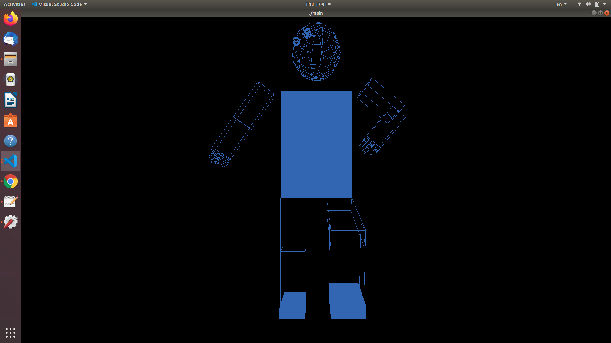
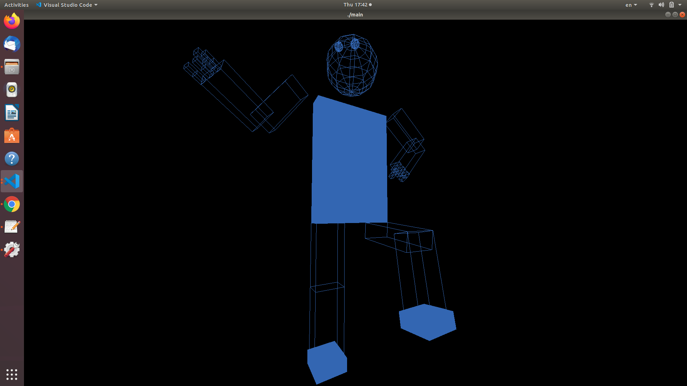
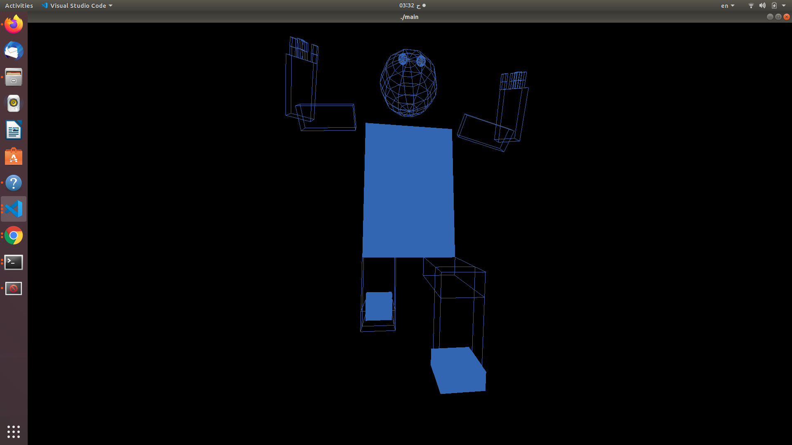
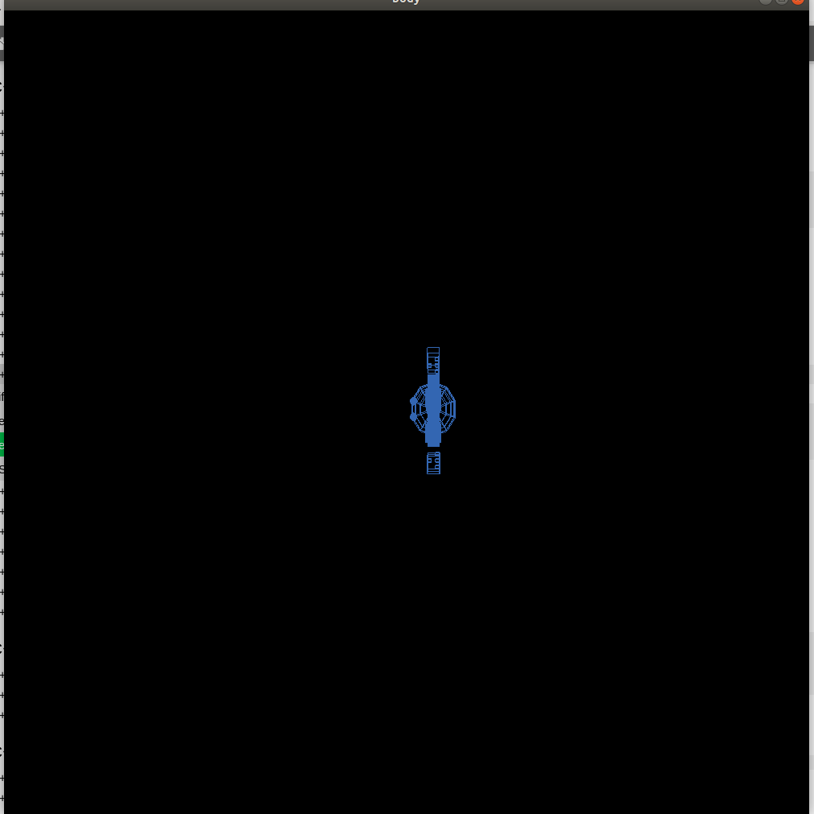
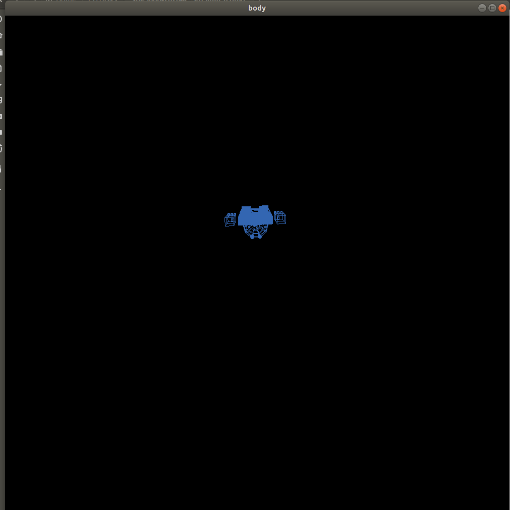
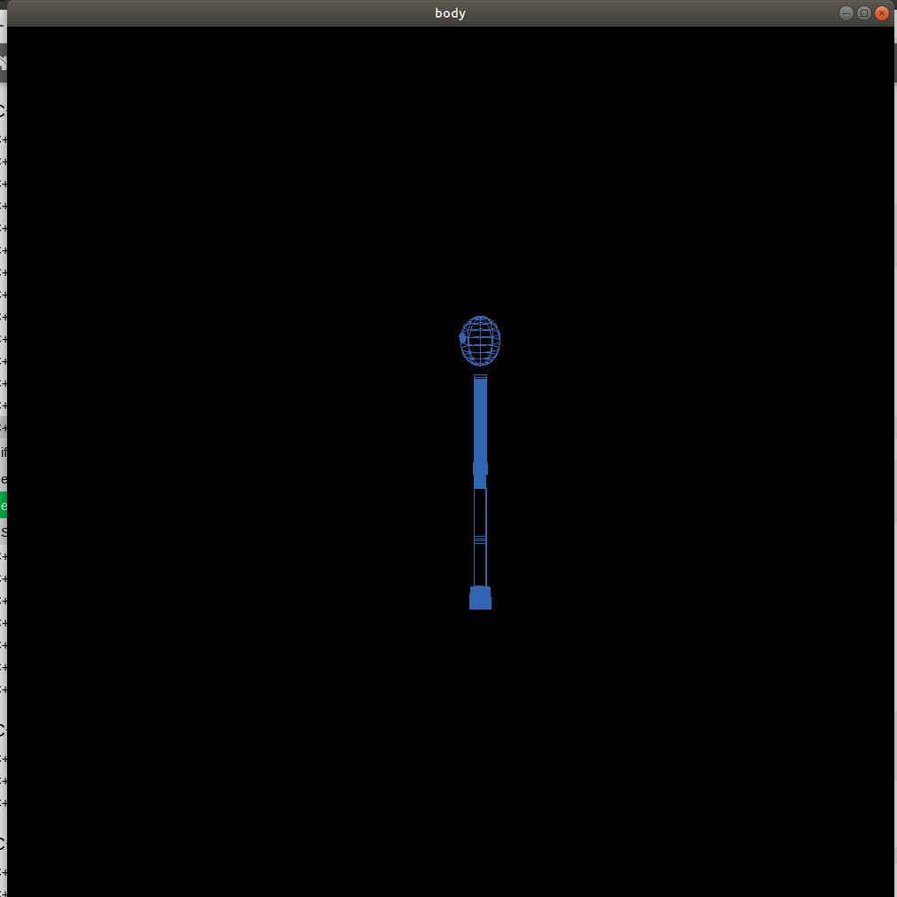
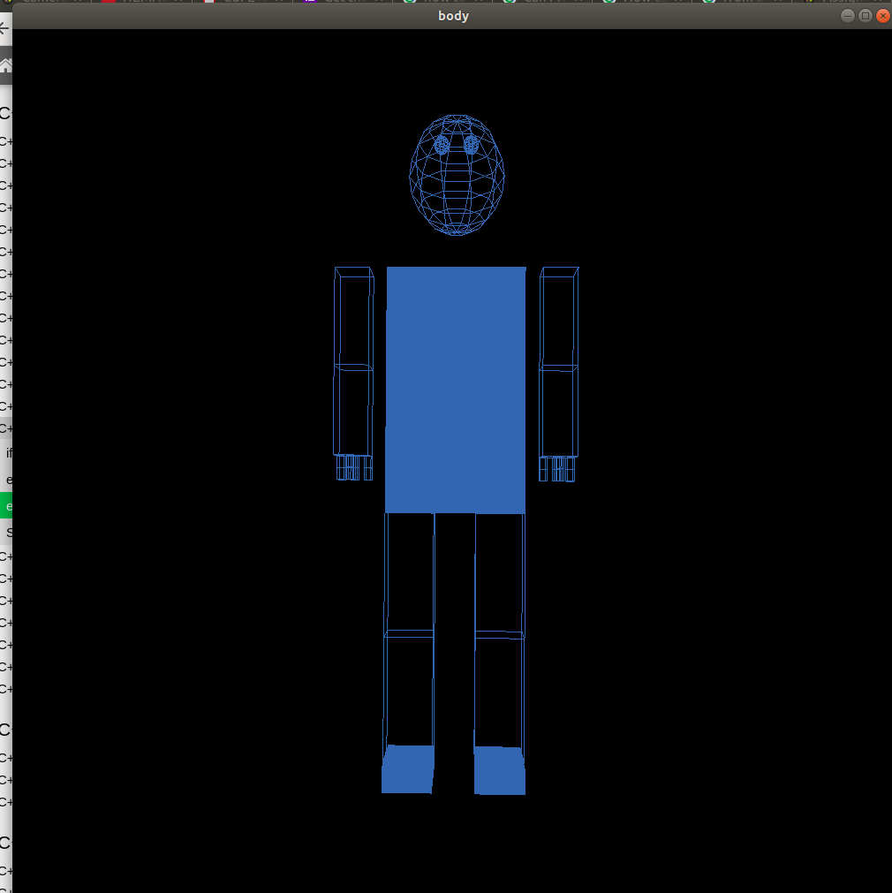
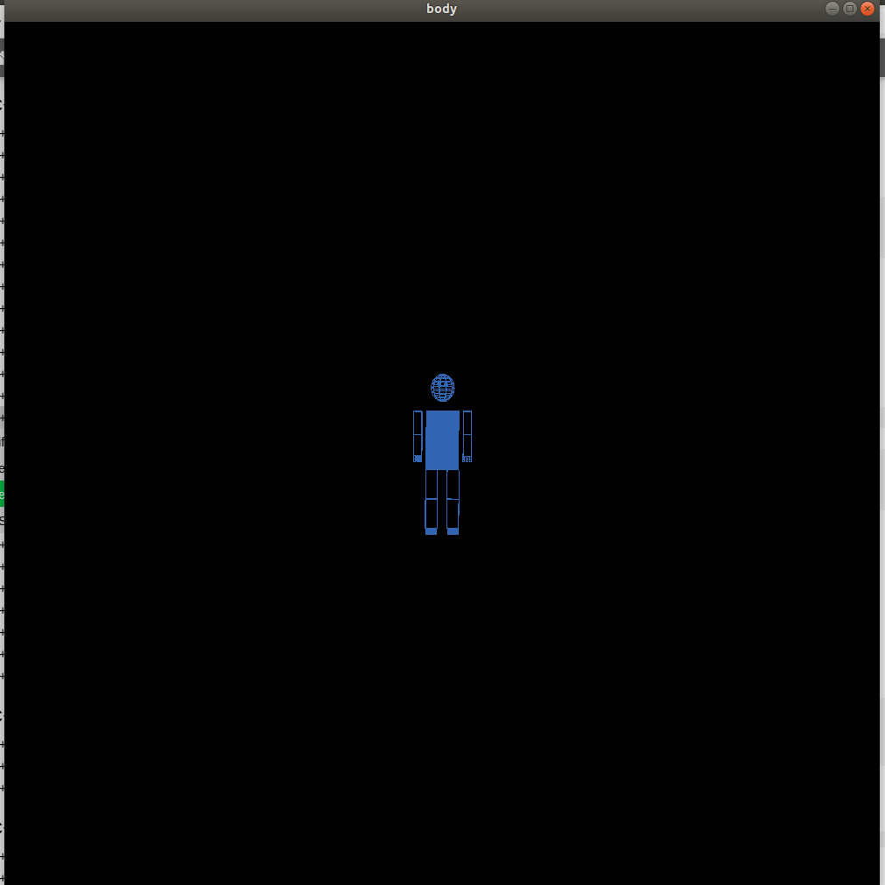

# Project Title

Full Robotic Body with Camera Movements

# Implementation

by making some functions to be used to draw cube and head and fingers and just call it and pass 3 or 4 parameters 

1.Making Chest 

Changing some values of the angle constriction by using if conditions 

Add some keymaps to move the new fingers 


# Examples



















# Issues

## Problems: 
1. first i didnt realize the direction and how to edit in coordinates 
2. second the change in one finger applied in the next fingers 
3. third the rotation resterictions and how to limit this 

## Solutions:
1. by try and see i discover it 
2. by putting **pushmatrix()** before and **pullmatrix()** after each finger 
3. by using **if conditions** by the suitable angle 
4 


### And coding  tests


```c++
    case 'e':
      if (elbow < 140){
      elbow = (elbow + 5) % 360;
      glutPostRedisplay();}
      break;
   case 'E':
      if (elbow > 0){
      elbow = (elbow - 5) % 360;
      glutPostRedisplay();}
      break;
```
```c++

void finger(GLdouble x, GLdouble y, GLdouble z,GLdouble fingerbase GLfloat fingerup) {
  
   glPushMatrix();
   //Draw finger flang 1 
   glTranslatef(x, y, z);
   glRotatef(fingerbase, 1.0, 0.0, 0.0);
   glTranslatef(0, -0.075, 0);
   wireBox(0.1,0.15,0.15);
      

   //Draw finger flang 1 
   glTranslatef(0, -0.075, 0);
   glRotatef(fingerup, 1.0, 0.0, 0.0);
   glTranslatef(0, -0.075, 0);

   // glTranslatef(-x, -y - 0.05, -z);
   wireBox(0.1,0.15,0.15);

   glPopMatrix();
  
}

```
```c++
// Draw cubes and copy it 
void wireBox(GLdouble width, GLdouble height, GLdouble depth) {
  glPushMatrix();
  glScalef(width, height, depth);
  glutWireCube(1.0);
  glPopMatrix();
}
```
```c++
// Draw sphere for head and eyes
void myWireSphere(GLfloat radius, int slices, int stacks) {
  glPushMatrix();
  glRotatef(-90.0, 1.0, 0.0, 0.0);
  glutWireSphere(radius, slices, stacks);
  glPopMatrix();
}
```

# Contributions
1. Abdullah elsayed
